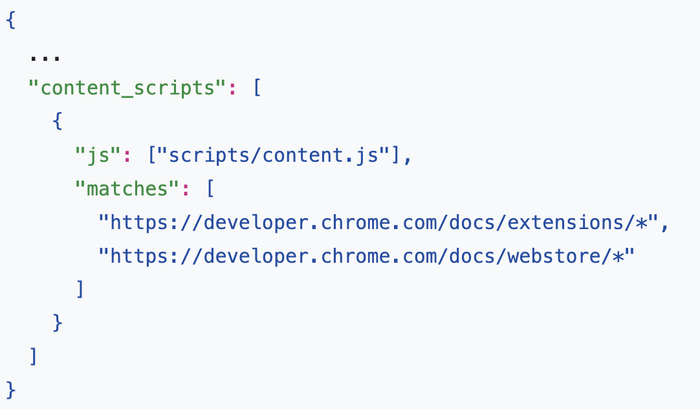

# chrome extension在每个页面上运行脚本

### 目标
1. 扩展清单。了解manifest.json文件
   1. 清单的最基本元素
      1. manifest_version
      2. name
      3. version
      4. description
2. 扩展程序使用什么图标大小。
   1. 16x16	扩展程序页面上的网站图标和上下文菜单图标。
   2. 32x32	Windows 计算机通常需要此大小。
   3. 48x48	显示在“扩展”页面上。
   4. 128x128	在安装时和 Chrome 网上应用店中显示。
3. 如何使用内容脚本将代码注入页面。
   1. 在manifest.json中添加`content_scripts`
   2. 
   3. 该"matches"字段可以有一个或[多个匹配模式](https://developer.chrome.com/docs/extensions/mv3/match_patterns/)。这些允许浏览器识别将内容脚本注入到哪些站点。匹配模式由三部分组成`<scheme>://<host><path>`。它们可以包含 ' *' 字符。
4. 如何使用匹配模式。
5. 扩展权限。
